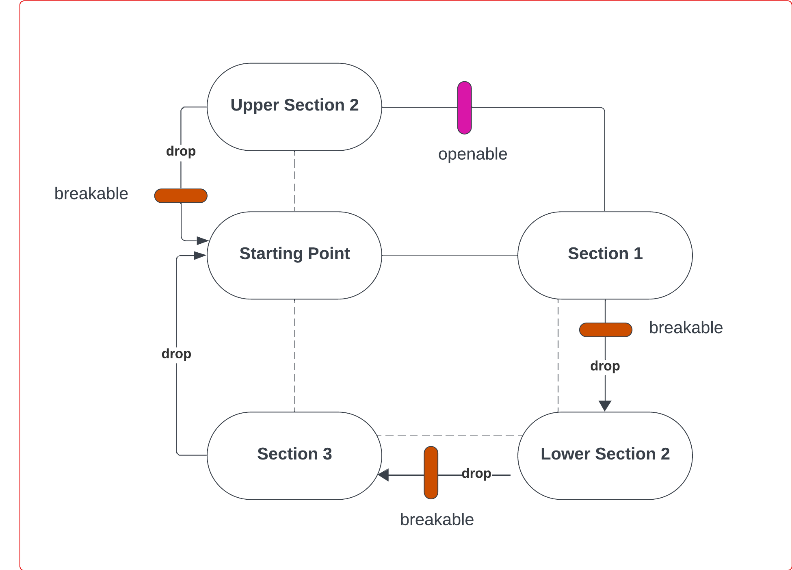

# COMP2150  - Level Design Document
### Name: Emma Austin
### Student number: 47789972 

## 1. Player Experience
### 1.1. Discovery
The player learns how to navigate the given level and the obstacles within through the gradual introduction of new challenges overtime. First, they are introduced to the jumping mechanic. While the player already knows the controls, it is important for them to discover the limits and constraints of the mechanic. This is done by having the player do some simple jumps, one showing the maximum height reachable.

Next, the player encounters spikes. The player is provided with a health pickup afterwards, so that the player may discover the effects of a spike without too much repercussion. A checkpoint is placed after so that future jumps can be repeated without unnecessary repetition of mastered sections.

The first encounter with an enemy is done on a reasonably empty platform, it is sectioned off from most harmful entities. This is so the player may play around and learn the gun and enemy mechanics in a simple manner.

A final example of discovery is with the dynamic of push able boxes being used on pressure pads. The player can see the door open, and the box above the button, but cannot exit the door without the box. This is then problematised for a more complex box-pushing puzzle, where the box must be pushed onto acid. 

The box floating in acid is seen near the boxes, as an example of what is required so that the player knows what is expected of them. 

### 1.2. Drama
The drama within the game aims to create experiential intensity for the player. This is done by having different areas focused on tasks of varying difficulties. The most intense parts of the level are towards the middle, where players are first getting used to fighting several enemies at once, and the end where the final path is littered with many dangerous encounters.
Here is the middle zone:

This tense moment is followed by a moment of relief, the player does a small loop back to the beginning of the level. It is short and easy, but acts as a break before what is probably the hardest puzzle in the level.

After this difficult puzzle is an easy, relaxing puzzle in preparation for the final difficult stretch.

The final stretch adds a final dramatic climax before the level’s resolution.

### 1.3. Challenge
In the drama aspect of this document I discussed the fluctuations in difficulty throughout the game used to create feelings of tension and relief. Despite these fluctuations, there is still a continual growth in the difficulty and challenges occurring which can be seen when comparing the first, second, and third section.

In section one, a significant challenge is the jump you make to get this first key. It is the first encounter with a moving platform that has danger beneath it, and the need to complete this jump creates tension.

In comparison, the third section of the game has a moving platform come out of and dip into acid, it also leads to a platform that has a chomper.

### 1.4. Exploration
The level has been made so that the player, while having a main linear path, can explore small offshoots for bonus health, challenge, or even an easier route as seen in the area below.

The level is mostly linear, and only has a small area repeated. This space is repeated to create a moment of relief and so that the player feels they are exploring a connected space, instead of a long straight tunnel. The player is encouraged to stay on the correct path by using a destructible wall to block the ‘incorrect’ way, the player must go the long route and reach the Staff. 

If the player continues the new given path, they learn how to open the previously blocked one.

Some screenshots may vary slightly from last minute edits (such as adding another health pack, or moving boxes to the left slightly).

## 2. Core Gameplay
### 2.4 Health Pickups / 2.6. Moving Platforms / 2.7. Passthrough Platforms

I introduced the players to moving and drop-down platforms early in the level where they feel free to explore without having to worry about enemies or hazards. They are welcome to spend as much time as they like testing jump heights and the speed of platforms here. They can also identify the health pick-up sound without accidentally picking it up yet, the player loops back through here briefly, and will be able to heal properly then.

### 2.2. Checkpoints / 2.8. Spikes

I introduce the players to spikes early within the level too, so that the player can practice interacting with and avoiding the spikes without many repercussions. If the player dies, they are right near the start, and if they succeed there is a checkpoint soon after the introductory spikes to avoid repetition. 

### 2.1. Acid 

I introduce players to acid reasonably early as well, so they know what they need to avoid in the future areas. The jump is short and can be completed easily. The player can also drop down and observe the acid at a closer height if they want. Seeing as acid respawns the player at the previous checkpoint, a checkpoint is placed right before the first patch of acid. This means any failures will have minimal setbacks.

### 2.5. Keys

The first key is introduced in a zone that has familiar hazards and platforms combined together for the first time. It is visible from the starting point and can be easily returned to if it is left behind accidentally. There are two ways to easily obtain the key, allowing the player to make their own decisions in regard to what they have previously learnt. 

### 2.3. Chompers / 2.10. Weapon Pickup (Gun)

The first weapon pickup, a gun, is introduced right before the first killable hazard is introduced. The weapon is only accessible after all non-moving hazards have been demonstrated first, so that the player knows it is not necessary to have a gun to avoid said hazards. This part of the level is flat, and the player is safe from the chomper and can observe its behavior before shooting it from a distance.

### 2.9. Spitters / 2.11. Weapon Pickup (Staff)

Finally, the sword pickup is introduced while the player is in a small area that is only escapable by utilizing the sword. The sword is introduced after the gun as it has more utility in this level. The first spitter can be observed and fought with the new weapon. Spitters were introduced after chompers as they are more confusing due to the moving projectile.

## 3. Spatiotemporal Design
Key for the Level Map diagrams seperate due to minimal whiteboard space:

 
### 3.1. Molecule Diagram

### 3.2. Level Map – Section 1

### 3.3.	Level Map – Section 2

### 3.4.	Level Map – Section 3

## 4. Iterative Design
Before starting on my main level design maps, I created several early prototypes of specific areas/sections within the game. This was important for figuring out how everything would connect, especially the small loop-around. The final level designs were made after iterative changes. I created small corners of storyboards and tried piecing them together, tweaking things and rearranging areas as I went. While doing this I tested things in Unity to become more comfortable with what is available.

This is an early prototype of section 3; the left side was eventually changed drastically so that the experience did not become ‘too easy’ near the end. The bottom of the map stayed similar, though upper platforms and puzzles were changed too.

 
Here is an early attempt at figuring out the loop-around that is present in the final version of the level. There was less exploration present for the player. An example of a change that was necessary was moving the switch so that it was underneath the box, as it was hard/impossible to push a box on-level with the switch onto said switch.

 
This is a much later storyboard in the iterative process. It was made to represent the second area within second two. By this point I already had a general idea of what I wanted with the puzzle. Further changes were still made, to help prevent the box from getting stuck. At this point in the iterative process I had a draft level completed and was starting to change around things in the level that felt ‘wrong’ as well. Such as changing the spitters to chompers, as they felt tedious to manage, it felt chance-like instead of strategic.

 
Finally, this is the main puzzle of section 3. I, after several attempts at figuring out the logic behind it, came up with this idea, but was unable to implement it with the switches and had to continue prototyping.

Here is another short design I came up with mid-work, which still was not implemented.

Overall, I ended up going with another idea that worked better with the prefabs provided. If I was to change anything about the level, I would be keen to make this platforming section at the start of area 3 more of a mental challenge for the players. I wanted to come up with something creative but felt limited by the time I had and ended up with a more mediocre puzzle solution than I would have liked. If I had more time, I would have liked to further improve this encounter through more iterative design.

